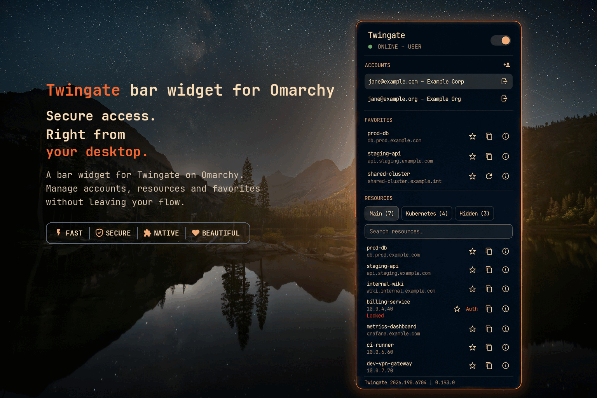

# Twingate for Omarchy



A bar widget for the [Omarchy](https://omarchy.org/) shell that shows [Twingate](https://www.twingate.com/) VPN status and gives you a panel to connect/disconnect, switch accounts, browse resources, and sync Kubernetes configs.

> **Prerequisite:** the [`twingate`](https://www.twingate.com/download) CLI must already be installed and set up (signed in to at least one account) before this widget will show anything useful. See [Requirements](#requirements) below.

## Disclaimer

This is an independent, personal project with no affiliation to, endorsement by, or partnership with Twingate. I built it for my own use and I'm sharing it in case it's useful to others — "Twingate" is used only to describe what the widget talks to, and remains a trademark of its respective owner.

## Features

- Bar icon with a status-dot badge (green = online, amber = authenticating, gray = offline/disconnected/error)
- Left-click opens the panel, right-click toggles the connection, middle-click refreshes resources
- One-click connect/disconnect, and a full keyboard-navigable panel
- Main / Kubernetes / Hidden tabs, each with a searchable, full resource list and its own actions (open in browser, copy address, sync `kubeconfig`, authenticate a locked resource)
- Star any resource to pin it to a Favorites strip above the tabs
- Account list showing every configured account, with one-click switching, per-account removal (`twingate account logout`, with a confirmation dialog), and an in-panel "Add account" flow
- Installed Twingate CLI version shown in the panel footer
- A clear notice if the `twingate` CLI isn't installed, and a `diagnostics` command for troubleshooting
- A native `pkexec` password/fingerprint prompt for connect/disconnect/switch by default, with a one-click gear-icon toggle to use a floating terminal instead

## Requirements

- The [`twingate`](https://www.twingate.com/download) CLI **installed and already set up** — signed in to at least one account (`twingate account add`) — before installing this plugin. The widget doesn't install, configure, or authenticate Twingate for you.
- `omarchy-launch-browser` (ships with Omarchy) — used to open a resource link when you click one in the panel
- `wl-copy` (ships with `wl-clipboard`, standard on most Wayland setups) — used to copy a resource's address
- `xdg-terminal-exec` and `uwsm-app` (ship with Omarchy) — used to open a floating terminal for connect/disconnect, account switching, add account, and resource authentication

No credentials are stored or handled by this plugin — it only shells out to the `twingate` CLI, which manages its own auth.

## Installation

```bash
omarchy plugin add https://github.com/jixt/omarchy-plugin-twingate --enable
```

## Usage

### Bar icon

- **Left-click** opens the panel
- **Right-click** toggles connect/disconnect (opens the panel with a full-panel notice pointing at the native prompt or the terminal, depending on the gear-icon setting)
- **Middle-click** refreshes the resource list

### Panel

- Toggle the switch at the top to connect/disconnect (a native password/fingerprint prompt appears if needed — or a floating terminal, in terminal mode)
- Click the gear icon next to the switch to choose between that native prompt (default) and a floating terminal for connect/disconnect/switch — see [Configuration](#configuration)
- Click the **?** button next to the switch for a keyboard/mouse shortcuts reference, right inside the panel
- Click an account row to switch to it (same native-prompt-or-terminal choice as above), or use "Remove account"/"+ Add account" to manage which accounts are configured
- Switch between the Main, K8s, and Hidden tabs, search, and click a resource to open it in your browser or a Kubernetes resource to sync its `kubeconfig`
- Authenticate a locked resource to open a terminal that shows the OAuth URL (Twingate's desktop notification often never reaches the session)
- Click the star on any resource to pin it to the Favorites strip

While connect/disconnect or account switch is waiting on authentication, the panel shows a full-panel notice with a spinner — **"Authentication needed"** pointing at the native prompt (pkexec mode), or **"Check the terminal"** pointing at the terminal window (terminal mode). Escape dismisses the notice — the underlying action keeps running either way.

### Keyboard

With the panel open and the search field not focused:

| Key | Action |
|-----|--------|
| `j` / `k` or arrow keys | Move the cursor across accounts, favorites, and the active resource list |
| `t` | Toggle connect/disconnect |
| `r` | Refresh |
| Enter / Space | Activate the highlighted row (open in browser / sync `kubeconfig` — same as a click) |
| `c` | Copy the highlighted resource's address |
| `a` | Authenticate the highlighted row, if it's locked |
| `i` | Show details for the highlighted row |
| `f` | Toggle the highlighted row as a favorite |
| `s` | Focus the search field |
| `h` | Toggle the keyboard/mouse shortcuts reference (same as the **?** button) |
| Escape | Dismiss the confirm dialog, then the authentication notice, then the shortcuts reference, then the details view, then close the panel |

The bar icon refreshes status every 5 seconds by default (configurable, see Configuration below). Accounts, resources, and the CLI version refresh whenever the panel is opened or manually refreshed.

### Global keybinding (optional)

No keybinding is set up by default. To add one, check which `SUPER + CTRL + <key>` combos are still free (`omarchy menu keybindings --print`), then add a line like this to `~/.config/hypr/bindings.lua` (it hot-reloads on save):

```lua
o.bind("SUPER + CTRL + G", "Toggle Twingate", "omarchy-shell shell toggle jixt.twingate")
```

Use `omarchy-shell shell toggle jixt.twingate` — **not** `omarchy-shell jixt.twingate toggle`. The bar renders once per monitor, so this plugin (like every bar widget) has a separate instance on each one; a direct `jixt.twingate toggle` call only ever reaches whichever instance's `IpcHandler` happened to claim that name first, opening the panel on the same fixed monitor regardless of where you actually are. Routing through `shell toggle` (the same mechanism the built-in Bluetooth/Network bindings use) opens the panel on whichever monitor is actually focused.

## Configuration

The refresh interval (5–3600 seconds, default 5) is configurable through the plugin's settings.

The gear icon in the panel header opens a settings view with one toggle: whether connect/disconnect/account-switch use `pkexec` (default) or a floating terminal. See [Privileges](#privileges) for what that actually changes. The choice is saved to `~/.local/state/jixt.twingate/prefs.json` — a plugin-local preference, not something set via `shell.json`/`omarchy bar set`.

Favorites (which resources you've starred) are saved to `~/.local/state/jixt.twingate/favorites.json` so they survive a panel close or shell restart. The panel also caches the last successful account/resource snapshot to `~/.local/state/jixt.twingate/snapshot.json`, so reopening it (even right after a shell restart) shows that data instantly instead of a blank panel while it refreshes in the background; the cache is cleared on sign-out. Everything else — accounts, resources, status — comes straight from the local `twingate` CLI on every refresh.

## What it runs

Most `twingate` probes (status, account list, resources, version, and similar) run through a wrapper that bounds their output (so a huge or hanging response can't affect the rest of the shell), disables colored output where the result is parsed, and is force-killed if they run too long.

Connect/disconnect and account switch run through `pkexec` by default — no terminal, just a native password/fingerprint prompt (see [Privileges](#privileges)). Toggle the panel's gear icon to run them in a floating terminal instead. Add account and resource authentication always use a floating terminal (`setsid` + `uwsm-app` + `xdg-terminal-exec` with Omarchy's `org.omarchy.terminal` app-id, so the window floats centered rather than tiling in the background) — neither is a good fit for `pkexec`. Beyond `twingate` itself, this plugin also runs:

- `which twingate` — detects whether the CLI is installed
- `wl-copy` — copies a resource's address to the clipboard
- `omarchy-launch-browser` — opens a resource link
- `pkexec` — elevates connect/disconnect/account-switch (default mode)
- `xdg-terminal-exec` / `uwsm-app` — opens a floating terminal for add-account, resource authentication, and connect/disconnect/switch when terminal mode is on

## Troubleshooting

- **"Twingate CLI is not installed or not on PATH."** — install the [`twingate`](https://www.twingate.com/download) CLI; the panel picks it up automatically on the next refresh, no restart needed.
- **Connect/disconnect fails or times out** — by default, a native polkit dialog asks for your password/fingerprint; in terminal mode (gear icon), a floating terminal opens instead and stays up with the error until you press Enter if the command fails. Either way, the panel shows "Command failed" or times out after 90 seconds. You can also run `twingate status -v` yourself to see the daemon's own output.
- **A terminal opened for add account or authenticate** — expected, always (regardless of the gear-icon setting): `account add` needs a TTY for its own prompts, and `auth` opens a terminal so you can see/copy the OAuth URL as a fallback to the desktop notification. Finish the flow in that window; the panel updates once it's done.
- **A terminal opened for connect, disconnect, or account switch** — means terminal mode is on (gear icon). Enter the sudo prompt (or scan/touch) in that window.
- **Panel shows "Authentication needed" or "Check the terminal"** — normal while a sudo prompt is pending for connect/disconnect/switch, with a spinner showing it's still active (there can be a real delay between the prompt actually being answered and the panel noticing). "Authentication needed" points at the native pkexec dialog; "Check the terminal" (terminal mode) points at the terminal window. Escape dismisses the notice without cancelling the underlying action.
- **Resource list looks empty** — normal for a few seconds right after connecting, switching accounts, or logging in/out, while the daemon restarts; if it stays empty, check that the signed-in account actually has resources assigned.
- **Status looks stuck** — periodic checks time out after 10 seconds; connect/disconnect/account-switch wait up to 90 seconds, and resource authentication up to 120 seconds, so a genuinely hung action clears its in-panel busy state within that window.
- **Diagnostics** — run `omarchy-shell jixt.twingate diagnostics` for a JSON dump of whether the CLI is installed, the current state, resource count, the last error, and the active settings. Other useful IPC commands: `omarchy-shell jixt.twingate connect|disconnect|refresh|status`.

## Removal

```bash
omarchy plugin remove jixt.twingate
```

## Privileges

Runs unsandboxed with your user permissions, same as any other Omarchy shell plugin. It only ever runs `twingate` and the small set of helpers listed above (`which`, `wl-copy`, `omarchy-launch-browser`, `pkexec`, `xdg-terminal-exec` / `uwsm-app`) — the plugin itself never calls `sudo` directly, and it does not install or update packages.

That said, `twingate connect`/`disconnect`/`account switch` are not privilege-free under the hood: the CLI re-execs itself through `sudo` one layer down (`sudo twingate-classic service-start --auth-mode user` / `sudo twingate-classic service-stop`) to manage the system service. That's Twingate's own design, not something this plugin arranges. By default, those three actions run through `pkexec twingate ...` — PolicyKit elevates the whole command up front via its own native prompt (Omarchy's polished dialog: password, fingerprint, or security key, whichever you have configured), which makes twingate's internal `sudo` re-exec a no-op (escalating root to root doesn't prompt). Toggle the panel's gear icon to run them in a floating terminal instead — the tradeoff is that you can watch `twingate`'s own output live as it happens (useful for seeing a connection error as it occurs), which the invisible `pkexec` path can't show you. The panel waits for the new status/account to show up (or times out after 90 seconds) either way; a `pkexec` cancel/failure is detected immediately instead of waiting out that timeout.

Resource-level authentication (`twingate auth`, for a locked resource) and adding an account (`account add`) always use the floating terminal — neither is `sudo`-gated, so `pkexec` doesn't apply to them.

### Skipping the authentication prompt (optional, at your own risk)

This applies regardless of the gear-icon setting — it targets the underlying `sudo` call either mode ultimately triggers. If you'd rather the toggle never prompt at all (neither the `pkexec` dialog nor a terminal password), you can grant your user passwordless `sudo` for exactly those two commands with a sudoers drop-in:

```
# /etc/sudoers.d/twingate — install with mode 0440, owned by root:root,
# and validate with `visudo -cf /etc/sudoers.d/twingate` before trusting it.
<user> ALL=(root) NOPASSWD: /usr/bin/twingate-classic service-start --auth-mode user, /usr/bin/twingate-classic service-stop
```

**Do this only if you understand the trade-off, and only at your own risk.** It doesn't grant broad `sudo` access — it's scoped to those exact two commands — but it does remove the one thing that requires *you, physically,* to be present for a connect/disconnect: once it's in place, **any process running as your user can silently start or stop your VPN connection**, with no password, no fingerprint, no security-key touch, and nothing that looks any different in the logs from you doing it yourself. For a Zero Trust client, that's a real (if narrow) hole, not a cosmetic one. This plugin does not install this rule for you, and removing it later is just deleting the file.

Editing `sudoers` incorrectly can lock you out of elevated access or weaken your system’s security. The developer of this plugin is **not responsible** for any damage, lockout, unauthorized access, or other consequences that result from adding, changing, or removing this rule — you are solely responsible for validating it (`visudo -cf …`) and for what happens after you install it.

## License

MIT — see [LICENSE](LICENSE).
